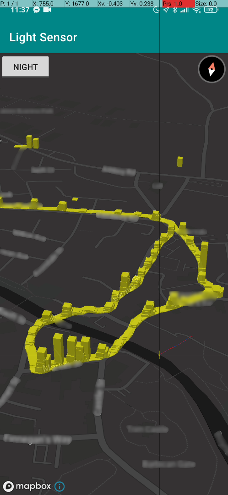
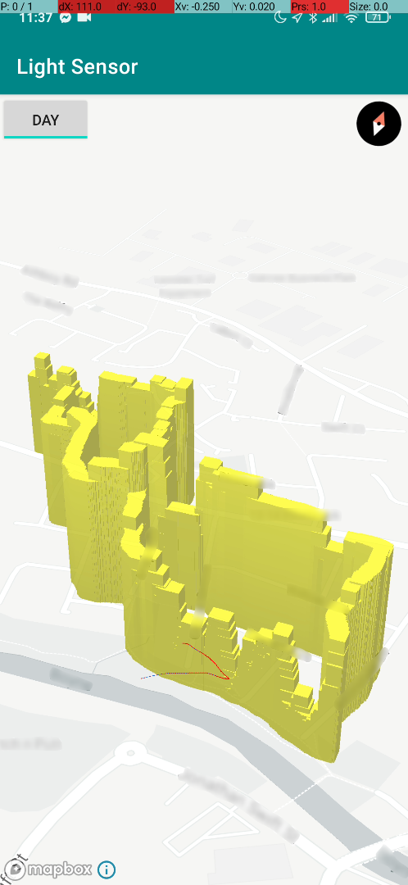

# Light-Sensor-App

Android application for gathering real-time light level data. Readings are stored in Firebase and rendered in 3D using [Mapbox](https://www.mapbox.com/).

Night Time | Day Time
-|-
 | 
